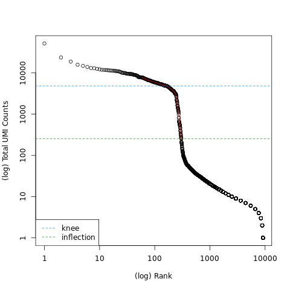

# scRNA-seq Count Matrix Generation — 1k PBMC (10x Chromium v3)

## Overview

This directory contains outputs from a single-cell RNA-seq preprocessing pipeline
applied to the **1k PBMCs from a Healthy Donor (v3 chemistry)** dataset from 10x Genomics.
The dataset consists of Peripheral Blood Mononuclear Cells (PBMCs) extracted from a
healthy donor, sub-sampled to ~300 cells for tutorial purposes.

The pipeline covers FASTQ alignment, UMI quantification, and barcode filtering to
produce a high-quality count matrix ready for downstream analysis.

> Full tutorial: [Producing a Count Matrix from FASTQ — Galaxy Training Network](https://training.galaxyproject.org)  
> Source data: [Zenodo record 3457880](https://zenodo.org/record/3457880)

---

## Pipeline Summary

| Step | Tool | Description |
|------|------|-------------|
| 1 | **RNA STARsolo** | Demultiplexing, alignment to hg19, UMI quantification |
| 2 | **MultiQC** | Mapping quality report from STARsolo log |
| 3 | **DropletUtils (Rank Barcodes)** | Knee plot to identify UMI thresholds |
| 4 | **DropletUtils (EmptyDrops)** | Custom filtering to retain high-quality cells |

---

## Key Parameters

| Parameter | Value |
|-----------|-------|
| Reference genome | hg19 (GRCh37) — chromosome X |
| Gene annotation | Homo_sapiens.GRCh37.75.gtf |
| Chemistry | 10x Chromium v3 (16 bp barcode + 12 bp UMI) |
| Barcode whitelist | 3M-february-2018.txt.gz |
| UMI deduplication | CellRanger2-4 algorithm |
| EmptyDrops lower-bound threshold | 200 UMIs |
| EmptyDrops FDR threshold | 0.01 |

---

## Results

### Mapping Quality (MultiQC — RNA STARsolo)

| Metric | Value |
|--------|-------|
| Total reads | 7.7 M |
| Aligned reads | 96.3% |
| Uniquely mapped reads | **87.5%** |
| Average mapped length | 89.3 bp |
| Mismatch rate | 0.5% |
| Deletion rate | 0.0% |
| Annotated splice junctions | 1.1 M |

> 87.5% unique alignment rate indicates high-quality mapping, well above the
> recommended minimum threshold of ~75% for scRNA-seq data.

---

### Barcode Rank (Knee) Plot

The plot above shows log-total UMI count vs. log-rank for each barcode:

| Threshold | Estimated UMI Count |
|-----------|-------------------|
| Knee point (blue dashed line) | ~3,000 UMIs |
| Inflection point (green dashed line) | ~200 UMIs |

The steep drop between the knee and inflection points separates **real cells**
(high UMI content) from **empty droplets** (low UMI content). A lower-bound
threshold of **200 UMIs** was applied, corresponding to the inflection point,
with an FDR of 0.01 to limit false positives to 1%.

---

### Detected Cells Plot

Red dots represent barcodes classified as **real cells** after EmptyDrops filtering.
Black dots represent empty droplets that were discarded.

---

### Cell Filtering Results

| Method | Cells Detected |
|--------|---------------|
| STARsolo raw (unfiltered) | ~5,200 barcodes |
| DropletUtils EmptyDrops (threshold=200, FDR=0.01) | **74 cells** |
| Total genes in filtered matrix | **57,774 genes** |

> The final count matrix dimensions are **57,774 genes × 74 cells**.

---

## Output Files

### `/outputs`

| File | Description |
|------|-------------|
| `starsolo_matrix.mtx` | Raw unfiltered count matrix from STARsolo (Matrix Market format) |
| `DropletUtils_matrix.mtx` | Filtered count matrix after EmptyDrops filtering |
| `DropletUtils_Barcodes.tsv` | 74 high-quality cell barcodes (EmptyDrops filtered) |
| `DropletUtils_features.tsv` | Gene features for EmptyDrops filtered matrix |
| `filtered_barcodes.tsv` | Cell barcodes from DefaultDrops (CellRanger-style) filtering |
| `filtered_features.tsv` | 57,774 gene features from DefaultDrops filtering |
| `multiqc_report.zip` | Full MultiQC HTML report of STARsolo alignment statistics |

### `/plots`

| File | Description |
|------|-------------|
| `DropletUtils_Plot.png` | Barcode rank plot showing knee (~3,000) and inflection (~200) thresholds |
| `DropletUtils Plot.png` | Scatter plot of -log probability vs total UMI count; red = retained cells |

---

## Downstream Analysis

The filtered output files are ready for import into downstream single-cell
RNA-seq analysis pipelines:

- **Scanpy** (Python / AnnData) — use `scanpy.read_mtx()`
- **Seurat** (R) — use `Read10X()`
- **RaceID** — see the [Downstream scRNA-seq tutorial](https://training.galaxyproject.org)

---

## Notes

- The sub-sampled dataset (~300 cells) was used instead of the full 1k PBMC
  dataset to reduce compute time. Full dataset outputs are available on Zenodo.
- Mapping was performed against **chromosome X only** due to compute constraints
  in the Galaxy tutorial environment, which explains the relatively lower cell
  count compared to a full genome run.
